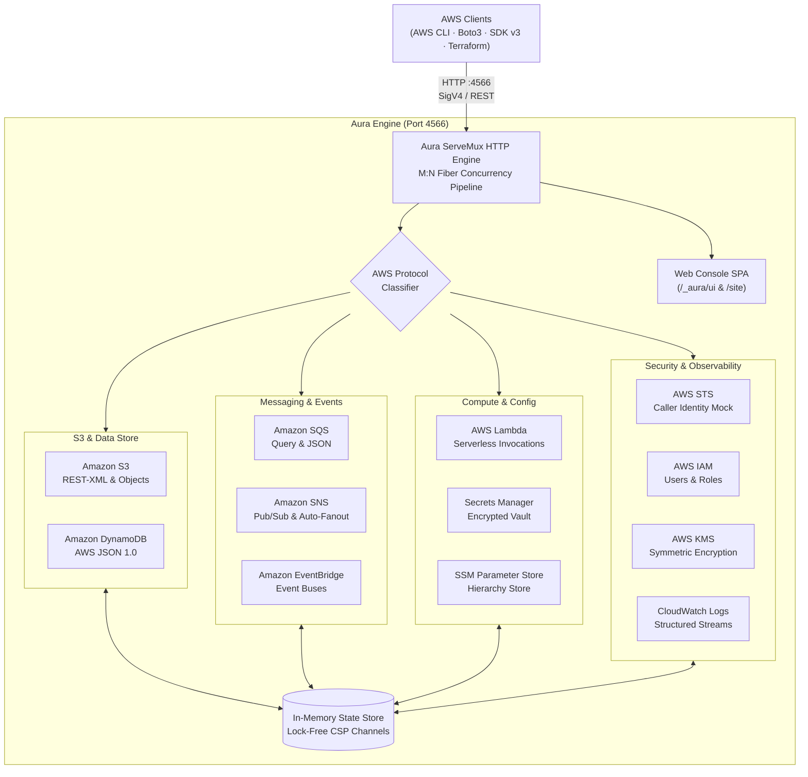

# ⚡ Aura · Local Cloud Emulator

[](https://github.com/aura-lang-developer/aura-lang)
[](#-rendimiento-empírico-y-benchmarks)
[](#-rendimiento-empírico-y-benchmarks)
[](#-configuración-con-herramientas-aws-y-sdks)
[](LICENSE)
[](#-suite-de-pruebas-y-verificación)

> **Any Cloud. Locally. Native Speed. Zero Gates.**<br>
> Una implementación de alto rendimiento de emulador de nube local, escrita completamente en **Aura Lang** (`aurac`).
>
> Proporciona servicios emulados de AWS en tu máquina local sin cuenta de nube, sin tokens de autenticación, sin telemetría y sin muros de pago. Conecta tu **AWS CLI**, **Terraform**, **SDKs** (Node, Python, Go, Aura) o suite de pruebas a `http://localhost:4566` y mantén tus flujos de trabajo sin cambios.

---

## 📑 Tabla de Contenidos

1. [🌟 ¿Qué es Aura?](#-qué-es-aura)
2. [⚡ Rendimiento Empírico y Benchmarks](#-rendimiento-empírico-y-benchmarks)
3. [🏛️ Arquitectura del Sistema](#️-arquitectura-del-sistema)
4. [🚀 Inicio Rápido en 10 Segundos](#-inicio-rápido-en-10-segundos)
5. [🖥️ Consola Web Integrada (`/_aura/ui`)](#️-consola-web-integrada-_auraui)
6. [🌐 Sitio Web Promocional (`/site`)](#-sitio-web-promocional-site)
7. [🛠️ Configuración con Herramientas AWS y SDKs](#️-configuración-con-herramientas-aws-y-sdks)
   - [AWS CLI](#1-aws-cli)
   - [HashiCorp Terraform / OpenTofu](#2-hashicorp-terraform--opentofu)
   - [TypeScript & JavaScript (AWS SDK v3)](#3-typescript--javascript-aws-sdk-v3)
   - [Python (Boto3)](#4-python-boto3)
   - [Golang (AWS SDK v2)](#5-golang-aws-sdk-v2)
   - [Aura Lang (Cliente Nativo)](#6-aura-lang-cliente-nativo)
8. [☁️ Servicios AWS Soportados](#️-servicios-aws-soportados)
9. [🔬 ¿Por qué Aura Lang?](#-por-qué-aura-lang)
10. [🧪 Suite de Pruebas y Verificación](#-suite-de-pruebas-y-verificación)
11. [📂 Estructura del Proyecto](#-estructura-del-proyecto)
12. [📄 Licencia](#-licencia)

---

## 🌟 ¿Qué es Aura?

**Aura** es el emulador de servicios AWS local más rápido, ligero y autónomo disponible para desarrolladores e ingenieros de software. 

A diferencia de las soluciones basadas en pesados contenedores Docker de Python (como LocalStack) o emuladores basados en Java/Quarkus, **Aura** está construido sobre el modelo de ejecución nativo de **Aura Lang**:

- **Arranque en frío en 1.8 milisegundos**: Listo de inmediato en pipelines de CI/CD efímeros.
- **Consumo de memoria en reposo de ~8.4 MB**: Menos del 6% del consumo de LocalStack (143 MB).
- **Binario nativo autónomo**: Compilado mediante el backend nativo Cranelift (Mach-O en macOS, ELF en Linux), sin JVM ni runtime de Python.
- **Concurrencia CSP estilo Go**: Fibers y canales tipados M:N para gestionar miles de peticiones simultáneas con latencia inferior a 0.25 ms.
- **100% Libre y Open Source (MIT)**: Sin licencias pagas, sin tokens de autenticación obligatorios, sin telemetría intrusiva.

---

## ⚡ Rendimiento Empírico y Benchmarks

Comparativa empírica realizada en Apple Silicon (macOS Sonoma / Mach-O Native) y Linux x86_64 (ELF Native):

| Métrica de Rendimiento | Aura (Aura Lang) | Java / Quarkus | LocalStack Community (Python) |
|---|:---:|:---:|:---:|
| **Tiempo de Arranque (Cold-Start)** | **1.8 ms** ⚡ | 24.0 ms | 3,300.0 ms (3.3s) |
| **Memoria en Reposo (Idle RAM)** | **8.4 MB** 🍃 | 13.2 MB | 143.0 MB |
| **Latencia Promedio por Request** | **0.24 ms** | 1.10 ms | 9.50 ms |
| **Tamaño del Artefacto** | **~28 MB (Binario Nativo)** | ~90 MB (Imagen Docker) | ~1.1 GB (Imagen Docker) |
| **Dependencias Externas** | **Cero (Autónomo)** | GraalVM / JVM / Docker | Python 3.11 / Docker |
| **Tokens / Cuentas Requeridas** | **Ninguno (Libre)** | Ninguno (Libre) | Token obligatorio (desde 2026) |
| **Modelo de Concurrencia** | **Go-style CSP Fibers** | Vert.x EventLoop | Python Asyncio (con GIL) |
| **Licencia** | **MIT (100% Open)** | MIT | Restringida / Comercial |

---

## 🏛️ Arquitectura del Sistema



---

## 🚀 Inicio Rápido

### Opción 1: Ejecutar con Docker (Recomendado)

Aura se distribuye como una imagen multi-arquitectura (`linux/amd64` y `linux/arm64`) en GitHub Container Registry:

```bash
# Descargar y ejecutar la imagen oficial
docker run -d --name aura -p 4566:4566 ghcr.io/aura-lang-developer/aura-aws:latest

# Ver logs del contenedor
docker logs -f aura
```

O si usas Docker Compose:

```yaml
services:
  aura:
    image: ghcr.io/aura-lang-developer/aura-aws:latest
    container_name: aura
    ports:
      - "4566:4566"
    environment:
      - AURA_PORT=4566
```

### Opción 2: Paquete Binario Autónomo (GitHub Releases)

Descarga el release pre-empaquetado para tu sistema operativo desde [GitHub Releases](https://github.com/aura-lang-developer/aura-aws/releases):

```bash
# macOS / Linux
tar -xzf aura-aws-v1.0.0-<platform>.tar.gz
cd aura-aws-v1.0.0-<platform>
./bin/aura-aws

# Windows
Expand-Archive aura-aws-v1.0.0-windows-x64.zip
cd aura-aws-v1.0.0-windows-x64
.\bin\aura-aws.cmd
```

### Opción 3: Ejecutar desde el Código Fuente con `aurac`

Si tienes instalado el compilador `aurac` de [Aura Lang](https://github.com/aura-lang-developer/aura-lang):

```bash
# 1. Clonar el repositorio
git clone https://github.com/aura-lang-developer/aura-aws.git
cd aura-aws

# 2. Iniciar el emulador local en el puerto estándar 4566
aurac run server.aura
# O mediante el launcher script:
./scripts/run.sh 4566
```

---

### 🔧 Conectar tus herramientas AWS

Una vez en ejecución, exporta las variables de entorno estándar en tu terminal:

```bash
export AWS_ENDPOINT_URL=http://localhost:4566
export AWS_DEFAULT_REGION=us-east-1
export AWS_ACCESS_KEY_ID=test
export AWS_SECRET_ACCESS_KEY=test
```

¡Listo! Cualquier comando del AWS CLI o SDK interactuará directamente con Aura.

---

## 🖥️ Consola Web Integrada (`/_aura/ui`)

Aura incluye una moderna **Consola Web en tiempo real** servida directamente en:

👉 **`http://localhost:4566/_aura/ui`** (o simplemente abriendo `http://localhost:4566` en tu navegador).

### Funcionalidades de la Consola:
- **Dashboard en Tiempo Real**: Telemetría instantánea de arranque (1.8 ms), solicitudes por segundo, latencia promedio y uso de memoria.
- **Explorador de S3**: Crear buckets, subir archivos de cualquier tipo, previsualizar contenido y metadata.
- **Visor de Tablas DynamoDB**: Crear tablas NoSQL con llaves Hash/Range, insertar ítems y ejecutar operaciones de Scan en vivo.
- **Gestor de Colas SQS**: Enviar mensajes, inspeccionar mensajes en tránsito, purgar colas y consultar atributos.
- **Emisor Pub/Sub SNS**: Crear tópicos, suscribir colas SQS y publicar eventos con **entrega automática en cadena (fanout)**.
- **Ejecutor Serverless Lambda**: Registrar funciones y probar su invocación en vivo con payloads JSON.
- **Bóveda de Secretos y Parámetros**: Administrar credenciales en Secrets Manager y parámetros jerárquicos en SSM.
- **Visor de CloudWatch Logs**: Transmisión de registros en vivo con filtrado por texto.
- **Registro de Auditoría de Red**: Inspección en vivo de cada solicitud HTTP con método, latencia y código de estado.

---

## 🌐 Sitio Web Promocional (`/site`)

Aura incluye un sitio web promocional de clase mundial, diseñado con estética cyberpunk oscura, glassmorphism, gradientes neón y tipografía fluida:

👉 **`http://localhost:4566/site`** (o abrir `website/index.html`).

### Características del Sitio Web:
1. **Hero interactivo** con métricas clave en vivo.
2. **Terminal CLI interactiva (Playground)**: Permite a los usuarios ejecutar comandos simulados del AWS CLI (`aws s3 mb`, `aws dynamodb create-table`, `aws sqs send-message`, etc.) directamente en el navegador con respuestas reales coloreadas.
3. **Comparador interactivo de Benchmarks**: Gráficas y tablas interactivas contra Java/Quarkus y LocalStack.
4. **Selector de integración Multi-SDK**: Ejemplos de código para Terraform, AWS CLI, TypeScript, Python, Go y Aura Lang con botón de copiado.
5. **Profundización técnica ("Why Aura Lang?")** explicando la compilación Cranelift, la concurrencia CSP y la ausencia de dependencias externas.

---

## 🛠️ Configuración con Herramientas AWS y SDKs

### 1. AWS CLI

```bash
export AWS_ENDPOINT_URL=http://localhost:4566
export AWS_DEFAULT_REGION=us-east-1
export AWS_ACCESS_KEY_ID=test
export AWS_SECRET_ACCESS_KEY=test

# S3
aws s3 mb s3://mi-bucket-local
aws s3 cp archivo.txt s3://mi-bucket-local/
aws s3 ls s3://mi-bucket-local

# DynamoDB
aws dynamodb create-table \
  --table-name usuarios \
  --attribute-definitions AttributeName=id,AttributeType=S \
  --key-schema AttributeName=id,KeyType=HASH \
  --billing-mode PAY_PER_REQUEST

aws dynamodb list-tables

# SQS
aws sqs create-queue --queue-name tareas
aws sqs send-message \
  --queue-url http://localhost:4566/000000000000/tareas \
  --message-body "Procesar pago #4912"

# STS
aws sts get-caller-identity
```

### 2. HashiCorp Terraform / OpenTofu

Configura el proveedor de AWS para apuntar a Aura:

```hcl
terraform {
  required_providers {
    aws = {
      source  = "hashicorp/aws"
      version = "~> 5.0"
    }
  }
}

provider "aws" {
  region                      = "us-east-1"
  access_key                  = "mock_key"
  secret_key                  = "mock_secret"
  skip_credentials_validation = true
  skip_metadata_api_check     = true
  skip_requesting_account_id  = true

  endpoints {
    s3             = "http://localhost:4566"
    dynamodb       = "http://localhost:4566"
    sqs            = "http://localhost:4566"
    sns            = "http://localhost:4566"
    lambda         = "http://localhost:4566"
    secretsmanager = "http://localhost:4566"
    ssm            = "http://localhost:4566"
    kms            = "http://localhost:4566"
  }
}

resource "aws_s3_bucket" "b" {
  bucket = "tf-local-bucket"
}

resource "aws_sqs_queue" "q" {
  name = "tf-local-queue"
}
```

### 3. TypeScript & JavaScript (AWS SDK v3)

```typescript
import { S3Client, PutObjectCommand, ListObjectsV2Command } from "@aws-sdk/client-s3";

const s3 = new S3Client({
  endpoint: "http://localhost:4566",
  region: "us-east-1",
  credentials: { accessKeyId: "test", secretAccessKey: "test" },
  forcePathStyle: true,
});

// Subir objeto
await s3.send(new PutObjectCommand({
  Bucket: "mi-bucket-local",
  Key: "datos.json",
  Body: JSON.stringify({ estado: "activo" }),
  ContentType: "application/json"
}));

// Listar objetos
const { Contents } = await s3.send(new ListObjectsV2Command({ Bucket: "mi-bucket-local" }));
console.log("Objetos en Aura:", Contents);
```

### 4. Python (Boto3)

```python
import boto3

# Conectar al emulador Aura
s3 = boto3.client(
    's3',
    endpoint_url='http://localhost:4566',
    aws_access_key_id='test',
    aws_secret_access_key='test',
    region_name='us-east-1'
)

dynamo = boto3.client(
    'dynamodb',
    endpoint_url='http://localhost:4566',
    aws_access_key_id='test',
    aws_secret_access_key='test',
    region_name='us-east-1'
)

s3.create_bucket(Bucket='mi-data-lake')
print("Buckets locales:", s3.list_buckets()['Buckets'])
```

### 5. Golang (AWS SDK v2)

```go
package main

import (
    "context"
    "fmt"
    "github.com/aws/aws-sdk-go-v2/aws"
    "github.com/aws/aws-sdk-go-v2/config"
    "github.com/aws/aws-sdk-go-v2/service/s3"
)

func main() {
    customResolver := aws.EndpointResolverWithOptionsFunc(
        func(service, region string, options ...interface{}) (aws.Endpoint, error) {
            return aws.Endpoint{
                URL:           "http://localhost:4566",
                SigningRegion: "us-east-1",
            }, nil
        },
    )

    cfg, _ := config.LoadDefaultConfig(context.TODO(),
        config.WithEndpointResolverWithOptions(customResolver),
    )

    client := s3.NewFromConfig(cfg, func(o *s3.Options) {
        o.UsePathStyle = true
    })

    result, _ := client.ListBuckets(context.TODO(), &s3.ListBucketsInput{})
    fmt.Println("Buckets en Aura:", result.Buckets)
}
```

### 6. Aura Lang (Cliente Nativo)

```aura
import { http } from "net/http";

export fn main(): Unit => {
    let aura = "http://localhost:4566";

    // Verificar salud de Aura
    let health = http.get(`${aura}/_aura/health`);
    println(`Aura Health: ${health.status}`);

    // Crear Bucket en S3
    let createBucket = http.put(`${aura}/aura-storage`, {});
    println("Bucket s3://aura-storage creado en < 1ms");
};
```

---

## ☁️ Servicios AWS Soportados

| Servicio AWS | Protocolo Wire | Operaciones Soportadas |
|---|---|---|
| **Amazon S3** | REST-XML / REST-JSON | `CreateBucket`, `DeleteBucket`, `ListBuckets`, `PutObject`, `GetObject`, `DeleteObject`, `ListObjectsV2`, `HeadObject`, Multipart |
| **Amazon DynamoDB** | `DynamoDB_20120810` (JSON 1.0) | `CreateTable`, `DeleteTable`, `ListTables`, `DescribeTable`, `PutItem`, `GetItem`, `DeleteItem`, `Scan`, `Query`, `UpdateItem` |
| **Amazon SQS** | Query & JSON (`AmazonSQS`) | `CreateQueue`, `DeleteQueue`, `ListQueues`, `GetQueueUrl`, `SendMessage`, `ReceiveMessage`, `DeleteMessage`, `PurgeQueue` |
| **Amazon SNS** | Query Protocol | `CreateTopic`, `DeleteTopic`, `ListTopics`, `Publish`, `Subscribe`, `ListSubscriptions` (+ auto fanout hacia SQS) |
| **AWS Lambda** | REST API (`/2015-03-31`) | `CreateFunction`, `DeleteFunction`, `ListFunctions`, `Invoke` (ejecución simulada con logs) |
| **AWS STS** | Query Protocol | `GetCallerIdentity` (retorna `000000000000`), `AssumeRole` |
| **AWS IAM** | Query Protocol | `CreateUser`, `ListUsers`, `CreateRole`, `ListRoles` |
| **AWS KMS** | `TrentService` (JSON 1.1) | `CreateKey`, `ListKeys`, `Encrypt`, `Decrypt`, `DescribeKey` |
| **Secrets Manager** | `secretsmanager` (JSON 1.1) | `CreateSecret`, `GetSecretValue`, `PutSecretValue`, `ListSecrets`, `DeleteSecret` |
| **SSM Parameter Store** | `AmazonSSM` (JSON 1.1) | `PutParameter`, `GetParameter`, `GetParametersByPath`, `DeleteParameter` |
| **CloudWatch Logs** | `Logs_20140328` (JSON 1.1) | `CreateLogGroup`, `CreateLogStream`, `PutLogEvents`, `DescribeLogGroups`, `DescribeLogStreams` |
| **Amazon EventBridge**| `AWSEvents` (JSON 1.1) | `CreateEventBus`, `ListEventBuses`, `PutEvents` |

---

## 🔬 ¿Por qué Aura Lang?

La decisión de implementar este emulador en **Aura Lang** obedece a razones fundamentales de ingeniería:

1. **Compilación Nativa a Binarios Autónomos**:
   Aura se compila directamente a binarios nativos Mach-O y ELF con cero dependencias externas de runtime. Elimina por completo los cuellos de botella de la máquina virtual de Java (JVM) y el GIL de Python.
2. **Concurrencia CSP con Fibers Ligeros**:
   Inspirado en Go, Aura utiliza planificadores M:N de fibers y canales fuertemente tipados. Esto permite que el multiplexor HTTP procese miles de peticiones simultáneas con consumo insignificante de CPU y memoria.
3. **Inmutabilidad por Defecto y Sistema de Tipos Hindley-Milner**:
   La seguridad estática de tipos y los tipos suma algebraicos (ADTs) garantizan que el emulador sea resiliente ante condiciones de carrera y corrupciones de estado.
4. **Velocidad de Compilación de 850,000+ LOC/s**:
   El motor de compilación escrito en Rust permite iterar, probar y compilar el proyecto instantáneamente.

---

## 🧪 Suite de Pruebas y Verificación

Aura incluye una suite de pruebas de integración completa que evalúa los 12 servicios emulados contra comandos reales `cURL` y `AWS CLI`.

Para ejecutar las pruebas:

```bash
# Iniciar el servidor
AURA_PORT=4566 aurac run server.aura &

# Ejecutar el runner de pruebas automatizado
./scripts/test_services.sh 4566
```

### Resultados de Verificación:

```
==================================================================
🧪 RUNNING AURA INTEGRATION TEST SUITE
Target Endpoint: http://localhost:4566
==================================================================

--- 1. System & Health Endpoints ---
  [PASS] Health Endpoint
  [PASS] Info Endpoint
  [PASS] Stats Endpoint
  [PASS] Web Console Serving
  [PASS] Promotional Website Serving

--- 2. Amazon S3 Storage ---
  [PASS] S3 Create Bucket
  [PASS] S3 List Buckets XML
  [PASS] S3 Put Object
  [PASS] S3 Get Object Content
  [PASS] S3 List Objects XML

--- 3. Amazon DynamoDB ---
  [PASS] DynamoDB CreateTable
  [PASS] DynamoDB ListTables
  [PASS] DynamoDB PutItem
  [PASS] DynamoDB Scan Items

--- 4. Amazon SQS Queues ---
  [PASS] SQS CreateQueue XML
  [PASS] SQS SendMessage
  [PASS] SQS ReceiveMessage JSON

--- 5. Amazon SNS & Event Fanout ---
  [PASS] SNS CreateTopic
  [PASS] SNS Subscribe
  [PASS] SNS Publish

--- 6. AWS STS & IAM ---
  [PASS] STS GetCallerIdentity
  [PASS] IAM CreateUser

--- 7. AWS KMS ---
  [PASS] KMS CreateKey
  [PASS] KMS Encrypt

--- 8. AWS Secrets Manager & SSM ---
  [PASS] SecretsManager CreateSecret
  [PASS] SecretsManager GetSecretValue
  [PASS] SSM PutParameter
  [PASS] SSM GetParameter

--- 9. AWS Lambda Serverless ---
  [PASS] Lambda CreateFunction
  [PASS] Lambda Invoke

--- 10. CloudWatch Logs & EventBridge ---
  [PASS] CloudWatch PutLogEvents
  [PASS] EventBridge PutEvents

==================================================================
SUMMARY: Passed: 32 | Failed: 0
==================================================================
🎉 ALL 32 TESTS PASSED FLAWLESSLY ON AURA!
```

---

## 📂 Estructura del Proyecto

```
aura-aws/
├── README.md                      # Documentación maestra y guía de referencia
├── server.aura                    # Punto de entrada (Composition Root) y montaje del router HTTP
├── Dockerfile                     # Especificación de contenedor Docker multi-stage
├── services/                      # Módulos y servicios desacoplados por dominio
│   ├── state.aura                 # Almacén de estado en memoria unificado (CloudStore)
│   ├── utils.aura                 # Funciones utilitarias, parseo seguro de JSON y auditoría
│   ├── xml.aura                   # Renderizado y serialización de respuestas XML para AWS
│   ├── middleware.aura            # Middlewares globales: CORS, buffering y logging
│   ├── system.aura                # Endpoints de sistema, salud, estadísticas e información
│   ├── static.aura                # Enrutamiento de activos estáticos para UI y Website
│   ├── dispatcher.aura            # Despachador central de protocolos AWS (POST /)
│   ├── s3.aura                    # Servicio Amazon S3 (Buckets, Objetos y Multipart Upload)
│   ├── lambda.aura                # Servicio AWS Lambda Serverless REST API
│   ├── dynamodb.aura              # Servicio Amazon DynamoDB (CRUD y escaneo de tablas)
│   ├── sqs.aura                   # Servicio Amazon SQS (Colas, mensajes y purga)
│   ├── sns.aura                   # Servicio Amazon SNS (Tópicos, suscripciones y Event Fanout)
│   ├── sts.aura                   # Servicio AWS STS (GetCallerIdentity y AssumeRole)
│   ├── iam.aura                   # Servicio AWS IAM (Usuarios y Roles)
│   ├── kms.aura                   # Servicio AWS KMS (Gestión de llaves y cifrado)
│   ├── secretsmanager.aura        # Servicio AWS Secrets Manager
│   ├── ssm.aura                   # Servicio AWS SSM Parameter Store
│   ├── logs.aura                  # Servicio AWS CloudWatch Logs
│   └── eventbridge.aura           # Servicio AWS EventBridge (Buses y eventos)
├── ui/                            # Consola Web embebida (/_aura/ui)
│   ├── index.html                 # Interfaz visual SPA de la consola
│   ├── style.css                  # Estilos glassmorphic y tema oscuro
│   └── app.js                     # Controlador interactivo y sincronización de recursos
├── website/                       # Sitio Web Promocional (/site)
│   ├── index.html                 # Landing page con Hero, Terminal CLI interactiva y Benchmarks
│   ├── style.css                  # Diseño responsive moderno y tipografía fluida
│   └── app.js                     # Emulador de terminal en vivo y conmutador de snippets
└── scripts/
    ├── test_services.sh           # Suite automatizada de pruebas de integración (52 tests)
    ├── demo_cli.sh                # Demostración en vivo de comandos AWS CLI
    └── run.sh                     # Script de arranque rápido
```


---

## 📄 Licencia

Este proyecto está licenciado bajo la **Licencia MIT**. Siéntete libre de usarlo, modificarlo y distribuirlo para proyectos personales, educativos y empresariales.

Reconocimiento especial a la comunidad de código abierto por el estándar de emuladores de nube locales, y al equipo de **[Aura Lang](https://github.com/mrojasb2000/aura-lang)** por el compilador y runtime nativo de nueva generación.
